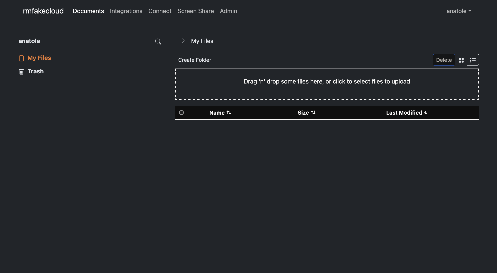
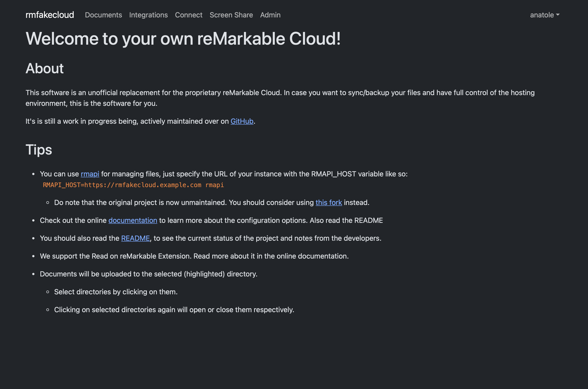

<!--
N.B.: This README was automatically generated by <https://github.com/YunoHost/apps_tools/blob/main/readme_generator>
It shall NOT be edited by hand.
-->

<h1>
  
  rmfakecloud, packaged for YunoHost
</h1>

Self-hosted cloud service and web UI for reMarkable devices

[](https://ddvk.github.io/rmfakecloud/)
[?style=for-the-badge)](https://ci-apps.yunohost.org/ci/apps/rmfakecloud/)

<div align="center">
<a href="https://apps.yunohost.org/app/rmfakecloud"></a>
<a href="https://github.com/YunoHost-Apps/rmfakecloud_ynh/issues"></a>
</div>


## Screenshots



## 📦 Developer info

[](https://ci-apps.yunohost.org/ci/apps/rmfakecloud/)

🛠️ Upstream rmfakecloud repository: <https://github.com/ddvk/rmfakecloud>

Pull request are welcome and should target the [`testing` branch](https://github.com/YunoHost-Apps/rmfakecloud_ynh/tree/testing).

The `testing` branch can be tested using:
```
# fresh install:
sudo yunohost app install https://github.com/YunoHost-Apps/rmfakecloud_ynh/tree/testing

# upgrade an existing install:
sudo yunohost app upgrade rmfakecloud -u https://github.com/YunoHost-Apps/rmfakecloud_ynh/tree/testing
```

You can also switch to the testing branch to update from testing by default (as same as for APT when you chose to use a testing repos) with this command:
```bash
sudo yunohost app setting rmfakecloud upgrade_channel -v testing
```

### 📚 App packaging documentation

Please see <https://doc.yunohost.org/dev/packaging/> for more information.
